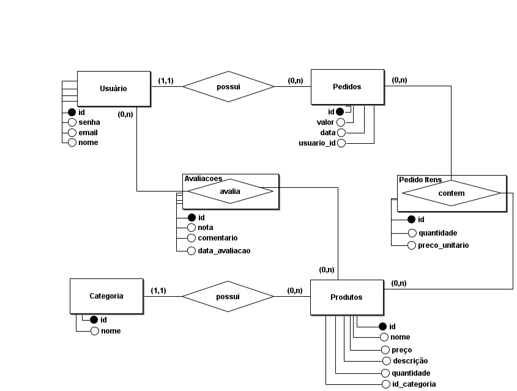

# Mini mundo \- Loja Virtual

A loja virtual possui um ambiente onde interagem dois tipos de usuários: **Cliente** e **Administrador**. O foco central do sistema são os **produtos**, que representam os itens disponíveis para venda, cada um caracterizado por um nome, preço, imagem e descrições. Para facilitar a organização e a navegação, todo **produto** pertence a uma **categoria** específica, que o classifica de acordo com sua natureza.

O Administrador é a entidade responsável pela gestão do sistema, possuindo credenciais de acesso que lhe conferem permissão para manipular o catálogo da loja. Suas funções incluem o cadastro de novos **produtos**, a edição de informações de itens existentes, a sua exclusão e também o gerenciamento das **categorias**.

O Cliente, por outro lado, é o consumidor final que navega pela loja visualizando os **produtos**, podendo também consultar comentários e avaliações deixados por outros compradores para auxiliar em sua decisão. Ao se interessar por um item, ele o adiciona ao seu Carrinho de Compras, um espaço pessoal e temporário onde acumula os **produtos** que deseja adquirir, podendo definir a quantidade de cada um. O processo de compra se concretiza quando o Cliente finaliza a operação, momento em que o conteúdo do seu carrinho de compras é transformado em um **Pedido**. Este **Pedido** torna-se um registro permanente da transação, associado unicamente àquele Cliente, e armazena detalhes como a data da compra, o valor total e a lista de **produtos** adquiridos. Para enriquecer a comunidade, o **Cliente** pode, posteriormente, publicar sua própria avaliação sobre um produto, registrando um comentário e uma nota que ficarão visíveis para outros usuários.

<h2>Esquema Conceitual</h2>
